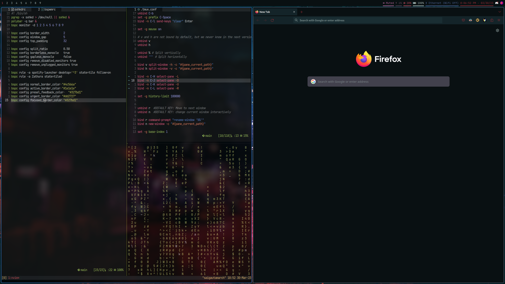

# dotfiles
Config I use to setup and customize i3-gaps with Arch Linux. 
## external dependencies
* i3-gaps (i3-wm)
* alacritty
* dunst
* neovim
* polybar
* rofi
* flashfocus
* xorg-xrdb
* pywal

I use the command `wal -i /path/to/image` to automatically set colorschemes for zsh, polybar, and firefox (using the Pywalfox extension). Here's a screenshot of my current setup:

</img>

